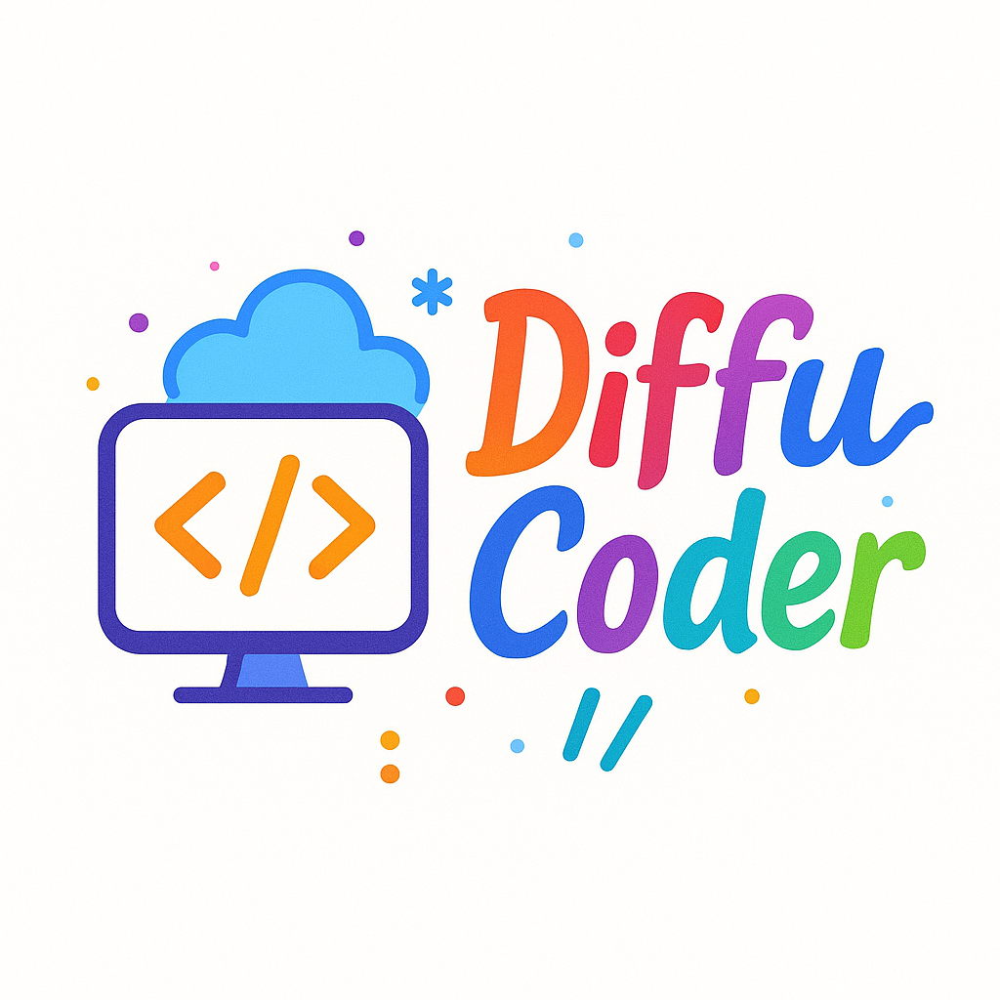
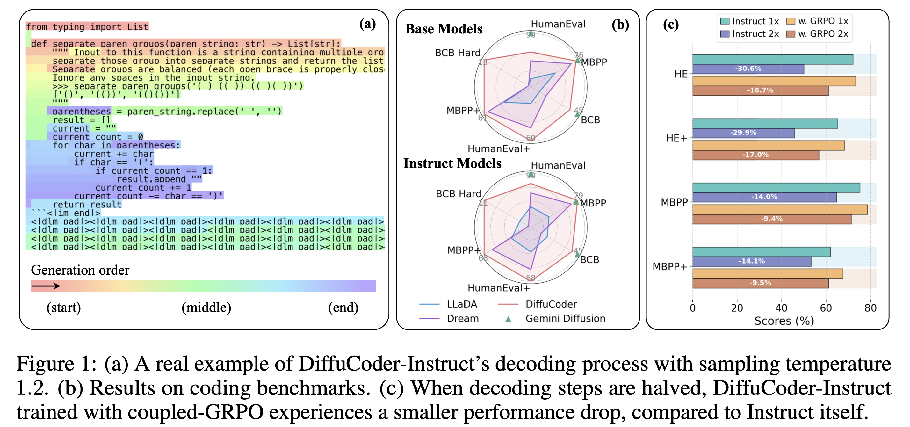
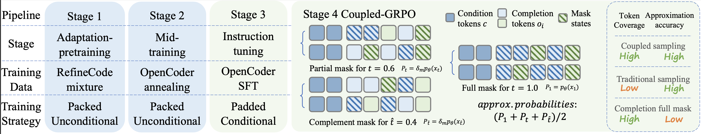

##  Masked Diffusion Models for Code Generation

[](https://arxiv.org/abs/2506.20639)
[](LICENSE)
[](https://huggingface.co/apple/DiffuCoder-7B-Base)
[](https://huggingface.co/apple/DiffuCoder-7B-Instruct)
[](https://huggingface.co/apple/DiffuCoder-7B-cpGRPO)


This software project accompanies the research paper, [DiffuCoder: Understanding and Improving Masked Diffusion Models for Code Generation](https://arxiv.org/abs/2506.20639).

### Updates

**MLX support on Apple Silicon is in progress. We will make necessary updates to the repository once it is available.**

- June 4, 2025. Update inference usage/examples/demo.
- June 2, 2025. Models are available on Huggingface.
- June 1, 2025. Code is available.

<div align="center">

</div>

### Motivation

Scaling upon Masked Denoising Models (MDMs), diffusion LLMs (dLLMs) such as [LLaDA](https://ml-gsai.github.io/LLaDA-demo/) and [Dream](https://hkunlp.github.io/blog/2025/dream/) have achieved performance on par with similarly sized autoregressive (AR) LLMs across many benchmarks. Recent commercial-scale dLLMs like [Mercury](https://chat.inceptionlabs.ai/) and [Gemini](https://deepmind.google/models/gemini-diffusion/) further demonstrate that diffusion-based code generators can rival top AR code models on programming tasks while offering faster text generation.

However, the generation pattern and post-training strategies of dLLMs remain under-explored. In this work, we investigate the following questions:

- **How does the generation pattern of dLLMs differ from AR models?**  
- **What is the difference in modeling different data modalities, such as code vs. math?**  
- **How diverse can dLLMs be, and how should post-training be designed?**  

<div align="center">

</div>

We train **DiffuCoder** using the adaptation approach in [DiffuLLaMA](https://github.com/HKUNLP/DiffuLLaMA) and introduce a new metric — **autoregressiveness score** — to quantify the causal pattern during dLLM generation. The key findings are listed below.

### Findings
- dLLMs still exhibit a left-to-right bias due to the nature of text, but they can also break this strict order in AR models.

- After pre-training, we show that code tasks induce less global AR-ness than math.

- In dLLMs, changing the sampling temperature not only affects sampled tokens (as in AR models), but also alters the generation order itself. 

For more interesting findings, please refer to our original paper!

We propose **Coupled-GRPO**, a post-training method to improve DiffuCoder's performance.

---

### Coupled-GRPO

In diffusion LLMs, the per-timestep loss $\mathcal{L}_{t}$ typically computes log-probabilities only at masked token positions, which leads to inefficiency and high variance when sampling is limited. To address this, **Coupled-GRPO** introduces a *coupled-sampling* scheme:

- For each training example, we select $\lambda$ pairs of timesteps $(t, \hat{t})$ such that $t + \hat{t} = T$.
- We apply two complementary token masks — each mask hides part of the tokens, and together they cover the entire set of target tokens.
- As a result, every token is unmasked in exactly one of the two forward passes.

This ensures that:
1. Every token's log-probability is computed at least once, providing a non-zero learning signal for all tokens.
2. The probability estimates are more accurate, since each token is evaluated in a realistic partially-masked context (rather than always being fully masked).
3. The scheme effectively uses $2\lambda$ times more sampling passes than the baseline (we choose $\lambda=1$), improving estimation with modest computational overhead.


In this repository, we release our implementation of **Coupled-GRPO**, built upon [open-r1](https://github.com/huggingface/open-r1/blob/6a0cd5c8ad031fc75118a4ce7f42a4860c3d8dea/).

### Getting Started
```
├── run.sh # start training
├── setup.py # modified open-r1/setup.py
├── src/open_r1/ #  our code based on open-r1
│   ├── configs.py # with diffusion related params
│   ├── coupled_grpo.py # inherits trl GRPOTrainer 
│   ├── grpo.py # main training script
│   ├── rewards.py # rewrite code reward and code_format reward 
│   ├── utils/code_providers.py # rewrite pass rate extraction for E2B
├── recipes/process_data.py # prepare grpo training data
├── recipes/config_coupled_code.yaml # training config
├── tests/test_code_reward.py # test sandbox execution for code
```
#### 1. Prepare code and environment
Clone the source code of Open-R1 from `git clone https://github.com/huggingface/open-r1`. Merge and replace files between ours and Open-R1's (including `setup.py`).

Set up the environment and dependencies following Open-R1: 
```bash
env=openr1
conda create -n $env python=3.11 -y -c anaconda
conda activate $env

pip install vllm==0.8.4
pip install setuptools
pip install flash-attn==2.8.0.post1 --no-build-isolation
pip install -e ".[code]"
```

Prepare a code sandbox at [E2B](https://e2b.dev/). Export your E2B token to `E2B_API_KEY` environment variable. Log in to wandb and export your `WANDB_ENTITY`.

#### 2. Data preparation
We prepare a hard split of GRPO training data based on [AceCode-89k](https://huggingface.co/datasets/TIGER-Lab/AceCode-87K).
```bash
cd recipes
python process_data.py --dataset_path "TIGER-Lab/AceCode-89K" --output_path "./acecode_hard.jsonl" --difficulty "hard"
```

#### 3. Start GRPO training
```bash
cd ..
bash run.sh 
# in `run.sh`, we start e2b server locally, but you can also run it on CPU clusters.
```

### Inference
The DiffuCoder models ([Base](https://huggingface.co/apple/DiffuCoder-7B-Base), [Instruct](https://huggingface.co/apple/DiffuCoder-7B-Instruct), and [cpGRPO](https://huggingface.co/apple/DiffuCoder-7B-cpGRPO)) are now available on HuggingFace. 

<details>
  <summary>Usage for Base model (click to expand) </summary>

  ```python
  import torch
  from transformers import AutoModel, AutoTokenizer

  model_path = "apple/DiffuCoder-7B-Base"
  model = AutoModel.from_pretrained(model_path, torch_dtype=torch.bfloat16, trust_remote_code=True)
  tokenizer = AutoTokenizer.from_pretrained(model_path, trust_remote_code=True)
  model = model.to("cuda").eval()

  prompt = """
  from typing import List

  def has_close_elements(numbers: List[float], threshold: float) -> bool:
      \"\"\"
      Check if in given list of numbers, are any two numbers closer to each other than given threshold.
      >>> has_close_elements([1.0, 2.0, 3.0], 0.5)
      False
      >>> has_close_elements([1.0, 2.8, 3.0, 4.0, 5.0, 2.0], 0.3)
      True
      \"\"\"
  """

  TOKEN_PER_STEP = 1 # diffusion timesteps * TOKEN_PER_STEP = total new tokens

  inputs = tokenizer(prompt, return_tensors="pt")
  input_ids = inputs.input_ids.to(device="cuda")
  attention_mask = inputs.attention_mask.to(device="cuda")

  output = model.diffusion_generate(
      input_ids,
      attention_mask=attention_mask,
      max_new_tokens=256,
      output_history=True,
      return_dict_in_generate=True,
      steps=256//TOKEN_PER_STEP,
      temperature=0.2,
      top_p=0.95,
      alg="entropy",
      alg_temp=0.,
  )
  generations = [
      tokenizer.decode(g[len(p) :].tolist())
      for p, g in zip(input_ids, output.sequences)
  ]

  print(generations[0].split(tokenizer.eos_token)[0])
  ```
</details>
<details>
<summary>Output (click to expand)</summary>

```
    # Sort the list to make it easier to find close elements
    numbers.sort()
    
    # Iterate through the list, checking each adjacent pair
    for i in range(len(numbers) - 1):
        # If the difference between the current and next element is less than the threshold, return True
        if numbers[i + 1] - numbers[i] < threshold:
            return True
    
    # If no such pair is found, return False
    return False
```
</details>

> Given an example input from the HumanEval test, the output of DiffuCoder-Base is a direct completion of the code snippet.

<details>
  <summary>Usage for Instruct model (click to expand) </summary>

  ```python
  import torch
  from transformers import AutoModel, AutoTokenizer

  model_path = "apple/DiffuCoder-7B-cpGRPO"
  model = AutoModel.from_pretrained(model_path, torch_dtype=torch.bfloat16, trust_remote_code=True)
  tokenizer = AutoTokenizer.from_pretrained(model_path, trust_remote_code=True)
  model = model.to("cuda").eval()

  query = "Write a function to find the shared elements from the given two lists."
  prompt = f"""<|im_start|>system
  You are a helpful assistant.<|im_end|>
  <|im_start|>user
  {query.strip()}
  <|im_end|>
  <|im_start|>assistant
  """ ## following the template of qwen; you can also use apply_chat_template function

  TOKEN_PER_STEP = 1 # diffusion timesteps * TOKEN_PER_STEP = total new tokens

  inputs = tokenizer(prompt, return_tensors="pt")
  input_ids = inputs.input_ids.to(device="cuda")
  attention_mask = inputs.attention_mask.to(device="cuda")

  output = model.diffusion_generate(
      input_ids,
      attention_mask=attention_mask,
      max_new_tokens=256,
      output_history=True,
      return_dict_in_generate=True,
      steps=256//TOKEN_PER_STEP,
      temperature=0.4,
      top_p=0.95,
      alg="entropy",
      alg_temp=0.,
  )
  generations = [
      tokenizer.decode(g[len(p) :].tolist())
      for p, g in zip(input_ids, output.sequences)
  ]

  print(generations[0].split('<|dlm_pad|>')[0])
  ```
</details>
<details>
<summary>Output (click to expand)</summary>

```
Here is the code to solve this problem: 
```python
def shared_elements(list1, list2): 
  return [value for value in list1 if value in  list2] 
```<|im_end|>
```
</details>

> Given an example input from the MBPP test, the output of DiffuCoder-cpGRPO is a chat-based response.

#### Demo
🚀 Start the demo and enter any prompt you want!
```bash
python inference_demo.py
```

### Evaluation
The diffusion inference algorithm is based on Dream-7B. The code evaluation is based on [Qwen2.5-Coder](https://github.com/QwenLM/Qwen2.5-Coder/tree/main/qwencoder-eval).

## Acknowledgments
We sincerely appreciate the following works for DiffuCoder:
- Our data used in pre-training/mid-training/instruction tuning are from [OpenCoder](https://huggingface.co/OpenCoder-LLM).
- Our instruction tuning code is based on [LLaMA-Factory](https://github.com/hiyouga/LLaMA-Factory).
- Our coupled-GRPO is built upon [Open-R1](https://github.com/huggingface/open-r1) and [d1](https://github.com/dllm-reasoning/d1).
- Our evaluation is built upon [Dream](https://github.com/HKUNLP/Dream) and [Qwen2.5-Coder](https://github.com/QwenLM/Qwen2.5-Coder/tree/main/qwencoder-eval).

## Citation
```bibtex
@article{gong2025diffucoder,
  title={DiffuCoder: Understanding and Improving Masked Diffusion Models for Code Generation},
  author={Shansan Gong, Ruixiang Zhang, Huangjie Zheng, Jiatao Gu, Navdeep Jaitly, Lingpeng Kong, Yizhe Zhang},
  year={2025},
  eprint={2506.20639},
  archivePrefix={arXiv},
  primaryClass={cs.CL},
  url={https://arxiv.org/abs/2506.20639},
}
```
